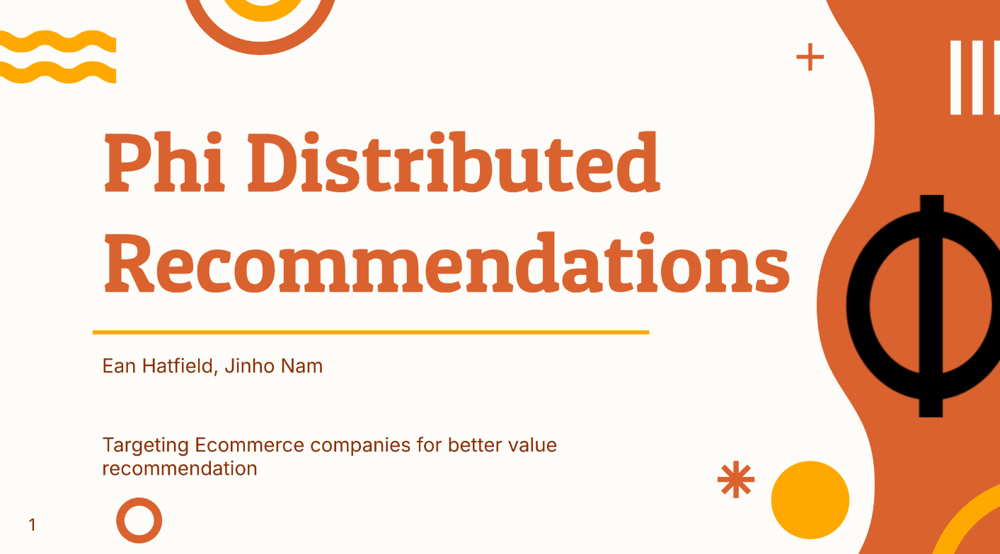

  

<h3 align="center"><strong>Phi Distributed Recommendation</strong></h3>

  Your personal, accessible, and powerful product recommender
   

## Presentations:
- [Stage 1](./Slides(Phase1).pdf)
- [Stage 2](./Slides(Phase2).pdf)
- [Stage 3](./Slides(Phase3).pdf)

## Demo Video:

https://github.com/user-attachments/assets/a4f2a691-031e-41bf-a9ed-3397512bbbbe

Youtube Version: https://www.youtube.com/watch?v=R_ioFtn7DPI

## What is Phi?

